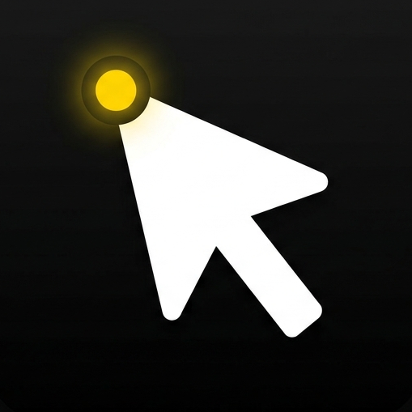

<p align="center">
  
</p>

<h1 align="center">Does your Ctrl+C really work?</h1>

<p align="center">
  A lightweight clipboard feedback tool that shows a visual animation near your cursor<br>
  when you copy (<code>Ctrl+C</code>) or paste (<code>Ctrl+V</code>) content.<br>
  Never wonder again whether your copy actually worked.
</p>

<p align="center">
  
  
  
</p>

## Features

- **Copy Success (Text)** — Yellow indicator dot + expanding panel with scramble-text reveal.
- **Copy Success (Image)** — 120x120 rounded thumbnail with pixel-style reveal animation.
- **Image Exit Animation** — Thumbnail shrinks toward the yellow indicator dot and disappears in sync with text collapse.
- **Web Image Compatibility** — Supports clipboard image extraction from:
  - Direct bitmap (`image/*`)
  - Local file URL/path (`text/uri-list`, `file:///...`)
  - HTML ``
  - `data:image/...;base64` and `http/https` image URL fallback
- **Copy Failed** — Red indicator dot (no valid copied content detected).
- **Paste Success** — Green indicator dot.
- **Silent Mode** — Toggle visual feedback on/off while app keeps running in tray (`Ctrl+Shift+M`).
- **Cursor-bound** — Animation follows your mouse directly, no delay.
- **System Tray Resident** — Background running with quick status and exit control.

<p align="center">
  
</p>

<p align="center">
  
</p>

## Usage

| Action | Effect |
|--------|--------|
| `Ctrl+C` (with text) | Yellow dot + text panel |
| `Ctrl+C` (with image) | Yellow dot + image thumbnail (and optional text label) |
| `Ctrl+C` (no selection / unchanged clipboard) | Red dot (copy failed) |
| `Ctrl+V` | Green dot (paste detected) |
| `Ctrl+Shift+M` | Toggle Silent Mode (visual feedback on/off) |
| `Ctrl+Shift+Q` | Quit the application |
| Right-click tray icon → Exit | Quit the application |

## Quick Start

```bash
cd dose-ctrlc
pip install -r requirements.txt
python main.py
```

If you only want to use it, download the `.exe` from Releases.

## Build

Recommended (avoid interpreter mismatch):

```bash
cd dose-ctrlc
python -m PyInstaller --noconfirm --clean --name "DoesCtrlCWork" --onefile --windowed --icon app_icon.ico --version-file version.txt --add-data "config.py;." main.py
```

If you use Conda and want to force a specific env:

```bash
conda run -n ctrlc python -m PyInstaller --noconfirm --clean --name "DoesCtrlCWork" --onefile --windowed --icon app_icon.ico --version-file version.txt --add-data "config.py;." main.py
```

Output exe location: `dist/DoesCtrlCWork.exe`.

> Note: `keyboard` library requires **Administrator privileges** for global hotkey detection on Windows.  
> Right-click the exe and choose "Run as administrator".

## New Release Description (Template)

Use this directly for your next release:

### v2.0.0 — Image-aware Clipboard Feedback + Silent Mode

This release upgrades Dose Ctrl+C from text-only feedback to rich clipboard feedback with image support and improved runtime control.

**Highlights**
- Added image copy feedback with pixel-style reveal and rounded 120x120 thumbnail.
- Added synchronized exit animation: image now shrinks back toward the yellow indicator dot while text panel collapses.
- Added Silent Mode hotkey (`Ctrl+Shift+M`) to disable visual feedback while keeping clipboard monitoring active.
- Improved clipboard parsing for real-world sources:
  - direct bitmap data
  - local file URL/path
  - HTML image source
  - data URI / web image URL fallback
- Improved Windows app identity and packaging metadata for cleaner executable presentation.

**Notes**
- For stable builds, package with `python -m PyInstaller` from the intended environment.
- Run as Administrator if global hotkey capture is blocked by system policy.

## Tech Stack

| Language / Framework | Purpose |
|---------------------|---------|
| Python | Core language |
| PySide6 (Qt 6) | GUI framework |
| pyperclip | Clipboard text fallback |
| keyboard | Global hotkey listener |
| PyInstaller | Windows executable packaging |

## File Structure

```text
dose-ctrlc/
├── main.py                   # Entry point: tray + hotkeys + event wiring
├── config.py                 # Animation timing, colors, sizes, params
├── requirements.txt          # Python dependencies
├── app_icon.ico              # Application icon
├── version.txt               # PyInstaller version metadata
├── build.bat                 # Build script
├── core/
│   ├── mouse_tracker.py      # Global cursor tracking + spring physics
│   └── clipboard_monitor.py  # Ctrl+C/V detection + rich clipboard extraction
└── ui/
    └── feedback_widget.py    # Dot/text/image animation lifecycle
```

## License

[MIT](../LICENSE)